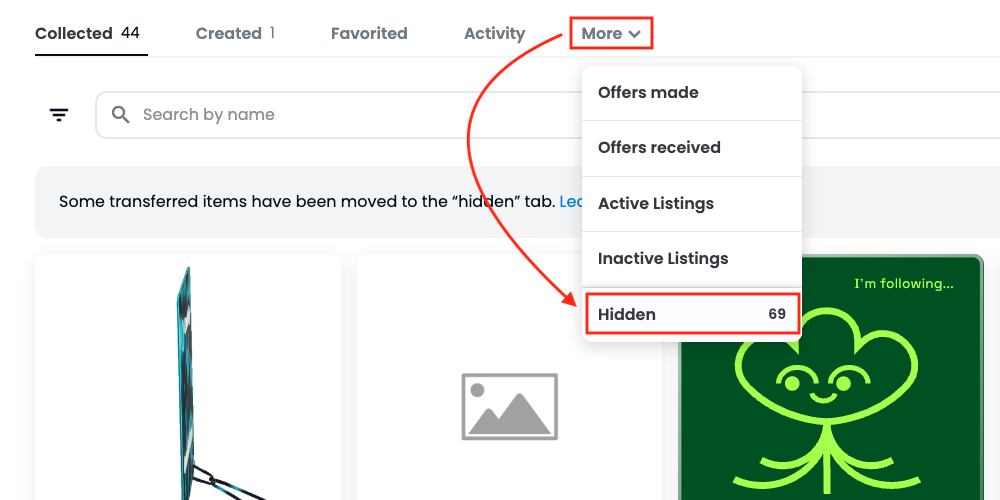

# Public Merkle Attester

The Public Merkle Attester issues attestations to users with an account that's part of an accounts merkle tree. ([more](../../../technical-concepts/accounts-registry-tree.md) on accounts tree)



The accounts merkle tree exists off-chain, and its root must be published on-chain in a roots registry accessible by the attester.

This attester will check whether a merkle proof is valid or not and issue the corresponding attestations.

#### Available groups

The available groups of this attester are all groups stored in a merkle tree whose root is in the roots registry, available to the attester.

The natural identifier of the group is the root itself.

Let's take the example of 'ENS Constitution Voters' accounts, stored in an [accounts merkle tree](../../../technical-concepts/accounts-registry-tree.md).


Example: group of 'ENS Snapshot voters' is the following:

* groupId: 21391204239043904329..1231293012 (accounts tree root value)
* accounts: voters of ENS, account values = 1 for all


#### Claims supported by the Public Merkle Attester

Users can claim to have an account that's part of an accounts tree.


User claim:

* groupId: root of the tree
* claimedValue: value of their account in the tree


#### Verify request function

This attester will check if the user claim is valid. The user needs to send the merkle proof so the attester can reconstruct the accounts tree.

* The attester will hash their address (account identifier) with their claimedValue (accountValue). It is a hashed account, stored as a leaf in the accounts merkle tree.
* The attester will then verify the merkle proof against the groupId (root of the accounts tree)

```solidity
function _verifyRequest(Request calldata request, bytes calldata proofData) internal virtual override {
    Claim memory claim = request.claims[0];
    MerkleProof memory merkleProof = abi.decode(proofData, (MerkleProof));
    
    if (!RootsRegistry.isRootAvailableForMe(claim.groupId))
        revert GroupNotAvailable;
    
    // this is the leave of the account in the accounts tree
    uint256 hashedAccount = uint256(keccak256(abi.encode(
        msg.sender, claim.claimValue
    )));
    
    // groupId is the root, hashedAccount is the leave
    if (!_verifyMerkleProof(claim.groupId, hashedAccount, merkleProof))
        revert ClaimInvalid;
  }
```

#### Build attestations function

Once the claim is verified (e.g a user has proved to be part of a group), the attester will generate an attestation from a collection that bundles all members of the relevant group:

```solidity
  // _collectionsInternalMapping(ENSAddress) = 1;
  function buildAttestations(Request calldata request, bytes calldata)
    public
    view
    virtual
    override(IAttester, Attester)
    returns (Attestation[] memory)
  {
    Attestation[] memory attestations = new Attestation[](1);

    Claim memory claim = request.claims[0];
    
    uint256 rootIndex = RootsRegistry.getRootIndex(claim.groupId);
    
    // 30 000 + 1, this attester is authorized from 30 000 to 40 000
    uint256 attestationCollectionId = AUTHORIZED_COLLECTION_ID_FIRST +
      rootIndex;

    address issuer = address(this);

    attestations[0] = Attestation(
      attestationCollectionId,
      request.destination,
      issuer,
      claim.claimedValue,
      block.timestamp,
      ''
    );
    return (attestations);
  }
```

#### Limitations


* This attester creates an immutable link between the source account and the destination.
  * Improvement: do it in ZK :)
* This attester can be used to send attestations to a destination that did not consent
  * Improvement: add proof of ownership for the destination


This is a relatively simple example used to demonstrate our attester standard - please open a [PR](https://github.com/sismo-core/sismo-protocol/tree/main/contracts/attesters) with an improved version of it!

Next up: doing this in a zk-SNARK while verifying the destination ownership: Hydra-S1: Simple Attester (one ZK Merkle Attester)
